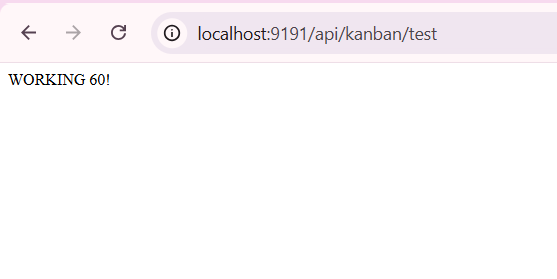
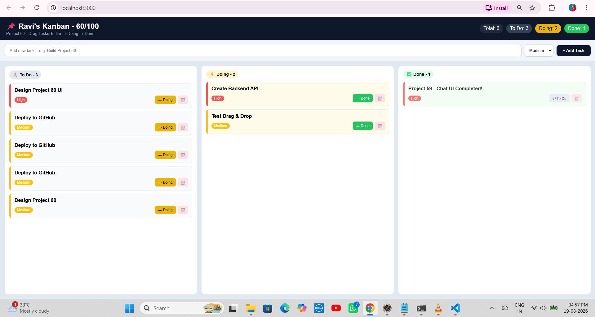

# 📋 Project 60 – Kanban Board + Tasks API | Trello Clone | Single Repo

<p align="left">


</p>

---

# 📖 Project Overview

**Kanban Board Trello Clone** is Project **60** of **Tier 6 – Frontend Mastery with React**, developed using **React 19**, **Spring Boot 3.3.3**, **TailwindCSS 3.4.1**, and **Axios** in a single monorepo.

React frontend running on port **3000** communicates with Spring Boot REST API running on port **9191** via Axios HTTP client.

Backend provides REST endpoints for:

- `GET /api/kanban/tasks`
- `POST /api/kanban/tasks`
- `PUT /api/kanban/tasks/{id}`
- `DELETE /api/kanban/tasks/{id}`
- `GET /api/kanban/stats`
- `GET /api/kanban/test`

The frontend visualizes the backend data with:

- Kanban header with stats
- Total tasks statistics
- To Do column
- Doing column
- Done column
- Task cards with priority
- Move To Do → Doing → Done buttons
- Delete task button
- Add new task input
- Priority selector Low/Medium/High
- Add Task button
- Task count badges
- Color coded priority
- Responsive 3 column layout

This single repository contains both backend and frontend, eliminating double repository management.

One clone gives the complete full-stack application.

**Bug Fixed:** `AxiosError: Network Error` was caused when the React frontend running on port `3000` could not access the Spring Boot backend running on port `9191`. This was fixed by ensuring Spring Boot runs on port `9191`, adding `@CrossOrigin(origins = "*")` in `KanbanController`, and using Axios `baseURL` `http://localhost:9191/api`.

The embedded Git issue `160000` from previous projects was also fixed by deleting nested `.git` folders and keeping the project as a single repository.

---

# ✨ Features

- Ravi's Kanban - 60/100 Project label
- Project 60 - Drag Tasks To Do → Doing → Done
- Kanban header
- Total tasks Statistics
- To Do Statistics
- Doing Statistics
- Done Statistics
- Add new task input
- Priority selector
- Add Task button
- 3 Column Board
- To Do - 3 tasks
- Doing - 2 tasks
- Done - 1 task
- Design Project 60 UI
- Create Backend API
- Test Drag & Drop
- Project 59 - Chat UI Completed!
- Deploy to GitHub
- Write README.md
- High priority - Red
- Medium priority - Yellow
- Low priority - Green
- → Doing button
- → Done button
- ↩ To Do button
- Delete button 🗑️
- Task cards UI
- Border left color priority
- High - #FF5252
- Medium - #FFC107
- Low - #4CAF50
- Yellow Doing column
- Green Done column
- Line through for Done tasks
- Real-time API updates
- Live API integration
- Axios REST API integration
- CORS handling
- React Hooks
- `useState`
- `useEffect`
- Flexbox
- Responsive board layout
- Rounded task cards
- Single repository architecture
- Backend + Frontend together
- Spring Boot REST API
- React frontend
- CRUD-style task operations
- GET Tasks API
- POST Tasks API
- PUT Tasks API
- DELETE Tasks API
- GET Stats API
- GET Test API

---

# 🛠 Technologies Used

- React 19.0.0
- Java 21
- Spring Boot 3.3.3
- TailwindCSS 3.4.1
- CSS
- Axios 1.6+
- Spring Web
- REST API
- Maven 3.9+
- JavaScript ES6+
- Node.js
- npm
- Apache Tomcat 10.1.30
- VS Code
- STS
- Eclipse IDE

---

# 📂 Project Structure - Single Repo

```text
60-kanban-board/
│
├── backend/
│   ├── src/
│   │   └── main/
│   │       ├── java/
│   │       │   └── com/
│   │       │       └── raviteja/
│   │       │           └── kanban/
│   │       │               ├── KanbanApplication.java
│   │       │               │
│   │       │               └── controller/
│   │       │                   └── KanbanController.java
│   │       │
│   │       └── resources/
│   │           └── application.properties
│   │
│   └── pom.xml
│
├── frontend/
│   ├── public/
│   │   └── index.html
│   │
│   ├── src/
│   │   ├── api/
│   │   │   └── api.js
│   │   │
│   │   ├── components/
│   │   │   └── KanbanBoard.jsx
│   │   │
│   │   ├── App.js
│   │   ├── index.js
│   │   └── App.css
│   │
│   ├── package.json
│   └── package-lock.json
│
├── screenshots/
│   ├── demo1.png
│   └── demo2.png
│
├── .gitignore
└── README.md
```

---

# ▶ How to Run - Single Repo

## 1⃣ Clone the Repository

```bash
git clone https://github.com/raviteja-dev950/60-kanban-board.git
cd 60-kanban-board
```

## 2⃣ Run Backend First - Port 9191

Open **STS / Eclipse IDE**.

Import the `backend` folder as an **Existing Maven Project**.

Verify:

`backend/src/main/resources/application.properties`

Use:

```properties
server.port=9191
spring.application.name=kanban-api
```

## 3⃣ KanbanController.java

Verify:

```java
package com.raviteja.kanban.controller;

import org.springframework.web.bind.annotation.*;
import java.util.*;

@RestController
@RequestMapping("/api/kanban")
@CrossOrigin(origins = "*")
public class KanbanController {

    List<Map<String, Object>> tasks = new ArrayList<>();

    public KanbanController() {

        addTask(1, "Design Project 60 UI", "To Do", "High");
        addTask(2, "Create Backend API", "Doing", "High");
        addTask(3, "Test Drag & Drop", "To Do", "Medium");
        addTask(4, "Project 59 - Chat UI Completed!", "Done", "High");
        addTask(5, "Write README.md", "Doing", "Low");
        addTask(6, "Deploy to GitHub", "To Do", "Medium");
    }

    private void addTask(
            int id,
            String title,
            String status,
            String priority) {

        Map<String, Object> t = new HashMap<>();

        t.put("id", id);
        t.put("title", title);
        t.put("status", status);
        t.put("priority", priority);
        t.put("time", "09:00");

        tasks.add(t);
    }

    @GetMapping("/test")
    public String test() {
        return "WORKING 60!";
    }

    @GetMapping("/tasks")
    public List<Map<String, Object>> getTasks() {
        return tasks;
    }

    @GetMapping("/stats")
    public Map<String, Object> getStats() {

        Map<String, Object> stats = new HashMap<>();

        long todo = tasks.stream()
                .filter(t -> "To Do".equals(t.get("status")))
                .count();

        long doing = tasks.stream()
                .filter(t -> "Doing".equals(t.get("status")))
                .count();

        long done = tasks.stream()
                .filter(t -> "Done".equals(t.get("status")))
                .count();

        stats.put("total", tasks.size());
        stats.put("todo", todo);
        stats.put("doing", doing);
        stats.put("done", done);

        return stats;
    }

    @PostMapping("/tasks")
    public Map<String, Object> addNewTask(
            @RequestBody Map<String, String> payload) {

        Map<String, Object> task = new HashMap<>();

        task.put("id", tasks.size() + 1);
        task.put("title", payload.get("title"));
        task.put(
                "status",
                payload.getOrDefault("status", "To Do")
        );
        task.put(
                "priority",
                payload.getOrDefault("priority", "Medium")
        );
        task.put(
                "time",
                java.time.LocalTime.now()
                        .toString()
                        .substring(0, 5)
        );

        tasks.add(task);

        return task;
    }

    @PutMapping("/tasks/{id}")
    public Map<String, Object> updateStatus(
            @PathVariable int id,
            @RequestBody Map<String, String> payload) {

        for (Map<String, Object> t : tasks) {

            if ((int) t.get("id") == id) {

                if (payload.containsKey("status")) {
                    t.put("status", payload.get("status"));
                }

                return t;
            }
        }

        return null;
    }

    @DeleteMapping("/tasks/{id}")
    public String deleteTask(@PathVariable int id) {

        tasks.removeIf(t -> (int) t.get("id") == id);

        return "Deleted Task " + id;
    }
}
```

## 4⃣ Run Backend

Right-click the project.

Select:

```text
Run As → Spring Boot App
```

Check the console:

```text
Tomcat initialized with port 9191 (http)
Tomcat started on port 9191 (http) with context path '/'
Started KanbanApplication
```

Open:

```text
http://localhost:9191/api/kanban/test
```

Open:

```text
http://localhost:9191/api/kanban/tasks
```

The backend should return JSON responses.

---

# 5⃣ Run Frontend - Port 3000

Open a new terminal.

```bash
cd frontend
npm install
npm install axios
npm start
```

The React application will start on:

```text
http://localhost:3000
```

---

# 6⃣ Axios API Configuration

Verify:

`frontend/src/api/api.js`

Use:

```javascript
import axios from "axios";

const api = axios.create({
    baseURL: "http://localhost:9191/api"
});

export default api;
```

---

# 🔄 Application Flow

```text
User
  │
  ▼
React Kanban UI
localhost:3000
  │
  ▼
KanbanBoard.jsx
  │
  ├── useState
  ├── useEffect
  ├── Axios
  └── Kanban Logic
  │
  ├── GET /api/kanban/tasks
  ├── POST /api/kanban/tasks
  ├── PUT /api/kanban/tasks/{id}
  ├── DELETE /api/kanban/tasks/{id}
  ├── GET /api/kanban/stats
  └── GET /api/kanban/test
  │
  ▼
Spring Boot REST API
localhost:9191
  │
  ▼
KanbanController
  │
  ├── Tasks
  ├── Stats
  └── Test
  │
  ▼
React Kanban Interface
  │
  ├── Header Stats
  │   ├── Total: 6
  │   ├── To Do: 3
  │   ├── Doing: 2
  │   └── Done: 1
  │
  ├── Add Task Input
  │
  ├── 3 Columns
  │   ├── To Do Column
  │   ├── Doing Column
  │   └── Done Column
  │
  ▼
Add Task
  │
  ├── Design Project 60
  └── Priority Medium
  │
  ▼
POST Task
  │
  ▼
Move Task
  │
  ├── To Do → Doing
  ├── Doing → Done
  └── Done → To Do
  │
  ▼
Board Updates
```

---

# 📊 Kanban Statistics

| Statistic | Value | Color |
|---|---:|---|
| Total | 6 | Dark |
| To Do | 3 | Gray |
| Doing | 2 | Yellow |
| Done | 1 | Green |

---

# 📋 Default Tasks

| ID | Title | Status | Priority |
|---:|---|---|---|
| 1 | Design Project 60 UI | To Do | High |
| 2 | Create Backend API | Doing | High |
| 3 | Test Drag & Drop | To Do | Medium |
| 4 | Project 59 - Chat UI Completed! | Done | High |
| 5 | Write README.md | Doing | Low |
| 6 | Deploy to GitHub | To Do | Medium |

---

# ➕ Add New Task

Example:

```text
Title: Design Project 60
Priority: Medium
```

After clicking Add Task:

```text
ID: 7
Title: Design Project 60
Status: To Do
Priority: Medium
Time: 04:57
```

---

# 🔄 Move Task

Call:

```text
PUT /api/kanban/tasks/1
Body: {"status": "Doing"}
```

The task moves from To Do to Doing.

Call:

```text
PUT /api/kanban/tasks/1
Body: {"status": "Done"}
```

The task moves from Doing to Done.

---

# 🗑 Delete Task

Call:

```text
DELETE /api/kanban/tasks/3
```

The task is removed from the board.

---

# 📸 Screenshots

## Demo 1 - Frontend Kanban UI

React Kanban UI running on:

```text
http://localhost:3000
```



## Demo 2 - Backend Kanban Test API

Spring Boot Kanban Test API running on:

```text
http://localhost:9191/api/kanban/test
```



---

# 🧪 API Testing Examples

## GET Test

```bash
curl http://localhost:9191/api/kanban/test
```

## GET Tasks

```bash
curl http://localhost:9191/api/kanban/tasks
```

## POST Add Task

```bash
curl -X POST http://localhost:9191/api/kanban/tasks -H "Content-Type: application/json" -d "{\"title\":\"New Task\",\"status\":\"To Do\",\"priority\":\"High\"}"
```

## PUT Move Task

```bash
curl -X PUT http://localhost:9191/api/kanban/tasks/1 -H "Content-Type: application/json" -d "{\"status\":\"Doing\"}"
```

## DELETE Task

```bash
curl -X DELETE http://localhost:9191/api/kanban/tasks/3
```

## GET Stats

```bash
curl http://localhost:9191/api/kanban/stats
```

---

# 📡 API Endpoints

| Method | Endpoint | Description |
|---|---|---|
| GET | `/api/kanban/test` | Test API is working |
| GET | `/api/kanban/tasks` | Get all kanban tasks |
| POST | `/api/kanban/tasks` | Add a new task |
| PUT | `/api/kanban/tasks/{id}` | Update task status |
| DELETE | `/api/kanban/tasks/{id}` | Delete a task |
| GET | `/api/kanban/stats` | Get kanban statistics |

---

# 📥 Expected Test Response

```text
WORKING 60!
```

---

# 📦 Expected Tasks Response

```json
[
  {
    "id": 1,
    "title": "Design Project 60 UI",
    "status": "To Do",
    "priority": "High",
    "time": "09:00"
  }
]
```

---

# 📊 Expected Stats Response

```json
{
  "total": 6,
  "todo": 3,
  "doing": 2,
  "done": 1
}
```

---

# 🧪 Frontend Testing

## Test 1 - Backend Test

Open:

```text
http://localhost:9191/api/kanban/test
```

Verify:

```text
WORKING 60!
```

## Test 2 - Backend Tasks

Open:

```text
http://localhost:9191/api/kanban/tasks
```

Verify the tasks JSON response.

## Test 3 - Frontend Kanban UI

Open:

```text
http://localhost:3000
```

Verify:

- Ravi's Kanban - 60/100 header
- Total, To Do, Doing, Done stats
- Add Task input
- 3 Columns To Do, Doing, Done
- Task cards

## Test 4 - Add Task

Enter:

```text
Title: Deploy to GitHub
Priority: Medium
```

Click **+ Add Task**.

Verify:

- New card in To Do column

## Test 5 - Move Task

Click **→ Doing** on To Do card.

Verify:

- Card moves to Doing column

Click **→ Done** on Doing card.

Verify:

- Card moves to Done column with line-through

## Test 6 - Verify Colors

```text
High Priority → Red #FF5252
Medium Priority → Yellow #FFC107
Low Priority → Green #4CAF50
To Do Column → White #FFFFFF
Doing Column → Yellow Light #FFFBEBDone Column → Green Light #F0FDF4
```

---

# 🎯 Learning Outcomes

- Understanding Full Stack Kanban application architecture
- Understanding Single Repo / Monorepo architecture
- Creating REST APIs using Spring Boot
- Using `@RestController`
- Using `@RequestMapping`
- Using `@GetMapping`
- Using `@PostMapping`
- Using `@PutMapping`
- Using `@DeleteMapping`
- Creating `/api/kanban/*` endpoints
- Configuring CORS using `@CrossOrigin`
- Connecting React with Spring Boot
- Using Axios for REST API communication
- Creating Axios instance with baseURL
- Using React `useState`
- Using React `useEffect`
- Fetching tasks from backend
- Adding tasks through POST requests
- Moving tasks through PUT requests
- Deleting tasks through DELETE requests
- Managing kanban state
- Creating controlled React inputs
- Creating 3 column kanban board
- Building task cards
- Differentiating To Do, Doing, Done
- Implementing status change logic
- Implementing priority colors
- Building Flexbox layouts
- Creating Trello style UI
- Implementing real-time UI updates
- Running React and Spring Boot simultaneously
- Running frontend on port 3000
- Running backend on port 9191
- Handling JSON data between React and Java
- Debugging Axios Network Error
- Understanding CORS issues
- Fixing nested Git repository issues
- Building a professional full-stack monorepo
- Understanding Monorepo vs Separate Repository architecture

---

# 🚀 Future Enhancements

- ➕ Add Edit Task functionality
- 🔍 Add Search Tasks
- 🏷 Add Labels and Tags
- 👤 Add Assignee
- 📅 Add Due Date
- 💬 Add Comments on Task
- 📎 Add Attachment
- 🔄 Add Real Drag & Drop with react-beautiful-dnd
- 📊 Add Progress Bar
- 🌙 Add Dark / Light Theme
- 🔐 Add JWT Authentication
- 👑 Add User Authentication
- 🖼 Add User Avatars
- 🗄 Switch in-memory data to MySQL
- 🗄 Add Spring Data JPA
- ☁ Deploy Frontend to Vercel
- ☁ Deploy Backend to Render
- 🧪 Add Jest Tests
- 🧪 Add React Testing Library
- 📱 Improve Mobile Responsiveness
- ⏰ Add Reminder Notifications
- 📈 Add Burndown Chart
- ✏ Add Task Description
- 🔔 Add Push Notifications
- 💾 Add Board Persistence
- 👥 Add Team Collaboration

---

# 👨‍💻 Author

**Ravi Teja**

Java Full Stack Developer

**100 Java Full Stack Projects Challenge**

**Project 60 / 100**

**Tier 6 – Frontend Mastery with React**

**Monorepo - Backend + Frontend**

---

# ⭐ Support

If you found this project helpful, consider giving it a ⭐ Star on GitHub.

**Single Repo:**

https://github.com/raviteja-dev950/60-kanban-board

**Backend:** `backend/` - Port `9191`

**Frontend:** `frontend/` - Port `3000`